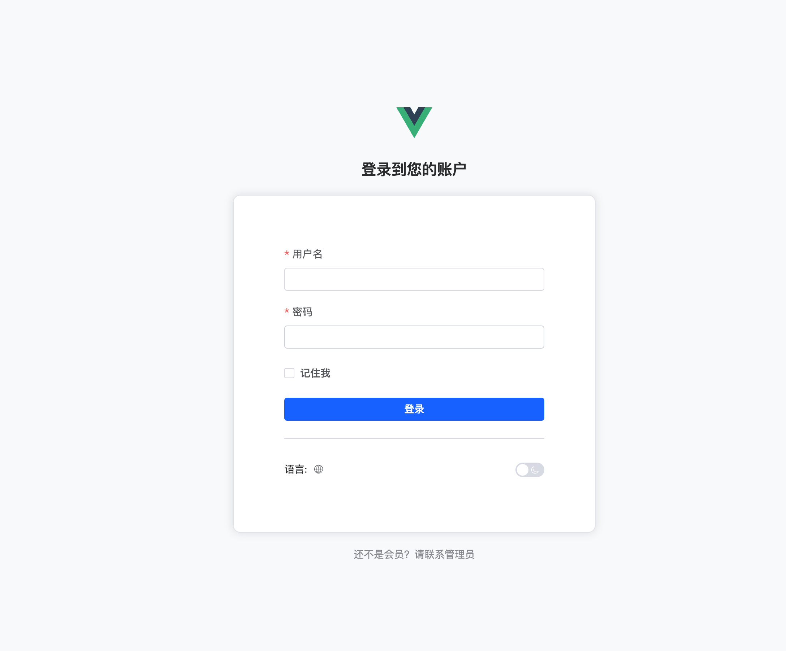
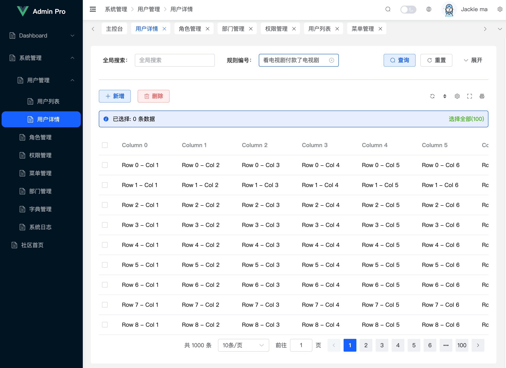
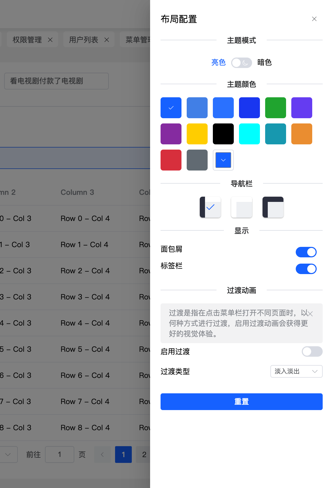

# simple-admin

基于Vue3+vite打造的纯前端后台管理系统模板

> 这只是个纯前端的模板 ，如果想直接使用，请选择: [SimplePro](https://www.mldoo.com/simplepro)(基于Django+vue2+elementui打造)

## 演示地址


## 预览







## Project Setup

```sh
npm install
```

### Compile and Hot-Reload for Development

```sh
npm run dev
```

### Type-Check, Compile and Minify for Production

```sh
npm run build
```
